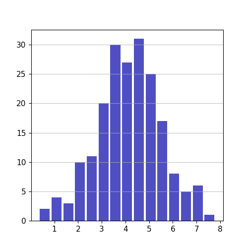
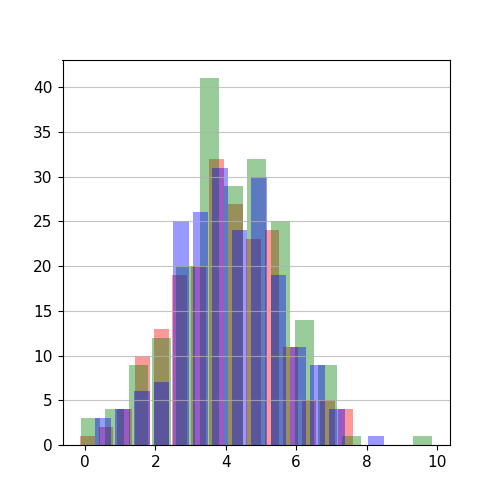

from cleopatra.statistical_glyph import StatisticalGlyph

# Statistic Class

The `statistical_glyph` module provides a class for creating statistical plots, specifically histograms. The class, `Statistic`, is designed to handle both 1D (single-dimensional) and 2D (multi-dimensional) data.

## Class Documentation

::: cleopatra.statistical_glyph.StatisticalGlyph
    options:
      show_root_heading: true
      show_source: true
      heading_level: 3

## Examples

### 1D Data Example

```python
import numpy as np
import matplotlib.pyplot as plt
from cleopatra.statistical_glyph import StatisticalGlyph

# Create some random 1D data
np.random.seed(1)
data_1d = 4 + np.random.normal(0, 1.5, 200)

# Create a Statistic object with the 1D data
stat_plot_1d = StatisticalGlyph(data_1d)

# Generate a histogram plot for the 1D data
fig_1d, ax_1d, hist_1d = stat_plot_1d.histogram()
```



### 2D Data Example

```python
# Create some random 2D data
data_2d = 4 + np.random.normal(0, 1.5, (200, 3))

# Create a Statistic object with the 2D data
stat_plot_2d = StatisticalGlyph(data_2d, color=["red", "green", "blue"], alpha=0.4, rwidth=0.8)

# Generate a histogram plot for the 2D data
fig_2d, ax_2d, hist_2d = stat_plot_2d.histogram()
```


