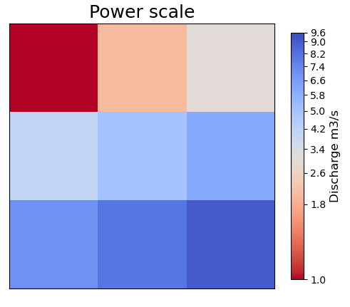

# Styles Module

The `styles` module provides classes and functions for styling plots, including line styles, marker styles, scaling functions, and color normalization.

## Styles Class

::: cleopatra.styles.Styles
    options:
      show_root_heading: true
      show_source: true
      heading_level: 3

## Scale Class

::: cleopatra.styles.Scale
    options:
      show_root_heading: true
      show_source: true
      heading_level: 3

## MidpointNormalize Class

::: cleopatra.styles.MidpointNormalize
    options:
      show_root_heading: true
      show_source: true
      heading_level: 3

## Examples

### Log Scale

```python
import numpy as np
import matplotlib.pyplot as plt
from cleopatra.styles import Scale

# Create some data with a wide range of values
data = np.array([0.1, 1, 10, 100, 1000])

# Apply log scale
scale = Scale()
log_data = scale.log_scale(data)

# Plot the original and log-scaled data
fig, (ax1, ax2) = plt.subplots(1, 2, figsize=(10, 4))
ax1.plot(data)
ax1.set_title('Original Data')
ax2.plot(log_data)
ax2.set_title('Log-Scaled Data')
plt.tight_layout()
```


### Power Scale

```python
# Apply power scale with gamma=0.5 (square root)
power_data = scale.power_scale(data)(0.5)

# Plot the original and power-scaled data
fig, (ax1, ax2) = plt.subplots(1, 2, figsize=(10, 4))
ax1.plot(data)
ax1.set_title('Original Data')
ax2.plot(power_data)
ax2.set_title('Power-Scaled Data (gamma=0.5)')
plt.tight_layout()
```



### Midpoint Normalize

```python
import numpy as np
import matplotlib.pyplot as plt
from cleopatra.styles import MidpointNormalize
import matplotlib.colors as colors

# Create some data with positive and negative values
data = np.random.uniform(-10, 10, (10, 10))

# Create a figure with two subplots
fig, (ax1, ax2) = plt.subplots(1, 2, figsize=(10, 4))

# Plot with standard normalization
im1 = ax1.imshow(data, cmap='RdBu_r', norm=colors.Normalize(vmin=-10, vmax=10))
ax1.set_title('Standard Normalization')
plt.colorbar(im1, ax=ax1)

# Plot with midpoint normalization (midpoint at 0)
im2 = ax2.imshow(data, cmap='RdBu_r', norm=MidpointNormalize(vmin=-10, vmax=10, midpoint=0))
ax2.set_title('Midpoint Normalization')
plt.colorbar(im2, ax=ax2)

plt.tight_layout()
```


